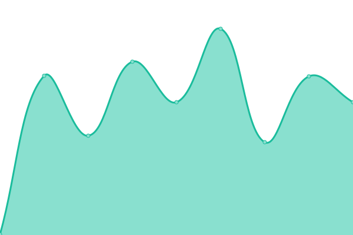

# [📈 Live Status](https://upptime.cs.uno.edu): <!--live status--> **🟩 All systems operational**

This repository contains the open-source uptime monitor and status page for [M. Toups](https://upptime.cs.uno.edu), powered by [Upptime](https://github.com/upptime/upptime).

With [Upptime](https://upptime.js.org), you can get your own unlimited and free uptime monitor and status page, powered entirely by a GitHub repository. We use [Issues](https://github.com/mtoupsUNO/uno-status/issues) as incident reports, [Actions](https://github.com/mtoupsUNO/uno-status/actions) as uptime monitors, and [Pages](https://upptime.cs.uno.edu) for the status page.

<!--start: status pages-->
<!-- This summary is generated by Upptime (https://github.com/upptime/upptime) -->
<!-- Do not edit this manually, your changes will be overwritten -->
<!-- prettier-ignore -->
| URL | Status | History | Response Time | Uptime |
| --- | ------ | ------- | ------------- | ------ |
|  [UNO CSCI redirect](https://www.cs.uno.edu) | 🟩 Up | [uno-csci-redirect.yml](https://github.com/mtoupsUNO/uno-status/commits/HEAD/history/uno-csci-redirect.yml) | 

 1207ms
     
 | 

<a href="https://upptime.cs.uno.edu/history/uno-csci-redirect">100.00%</a>
    

|  [UNO Bioinformatics website](https://biomall.cs.uno.edu) | 🟩 Up | [uno-bioinformatics-website.yml](https://github.com/mtoupsUNO/uno-status/commits/HEAD/history/uno-bioinformatics-website.yml) | 

 419ms
     
 | 

<a href="https://upptime.cs.uno.edu/history/uno-bioinformatics-website">100.00%</a>
    

|  [UNO CSCI Autolab](https://autolab.cs.uno.edu) | 🟩 Up | [uno-csci-autolab.yml](https://github.com/mtoupsUNO/uno-status/commits/HEAD/history/uno-csci-autolab.yml) | 

 349ms
     
 | 

<a href="https://upptime.cs.uno.edu/history/uno-csci-autolab">100.00%</a>
    

|  [UNO CSCI webterminal (guacamole)](https://webterminal.cs.uno.edu) | 🟩 Up | [uno-csci-webterminal-guacamole.yml](https://github.com/mtoupsUNO/uno-status/commits/HEAD/history/uno-csci-webterminal-guacamole.yml) | 

 393ms
     
 | 

<a href="https://upptime.cs.uno.edu/history/uno-csci-webterminal-guacamole">100.00%</a>
    

|  [UNO CSCI gitlab](https://gitlab.cs.uno.edu) | 🟩 Up | [uno-csci-gitlab.yml](https://github.com/mtoupsUNO/uno-status/commits/HEAD/history/uno-csci-gitlab.yml) | 

 390ms
     
 | 

<a href="https://upptime.cs.uno.edu/history/uno-csci-gitlab">100.00%</a>
    

<!--end: status pages-->

[**Visit our status website →**](https://upptime.cs.uno.edu)

## 📄 License

- Powered by: [Upptime](https://github.com/upptime/upptime)
- Code: [MIT](./LICENSE) © [M. Toups](https://upptime.cs.uno.edu)
- Data in the `./history` directory: [Open Database License](https://opendatacommons.org/licenses/odbl/1-0/)
